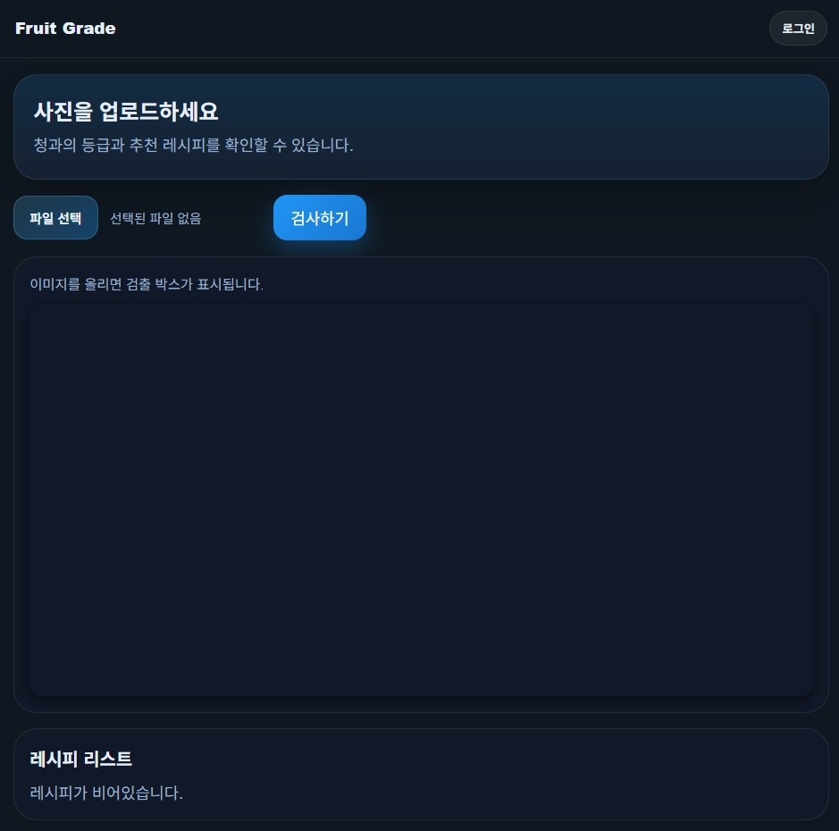
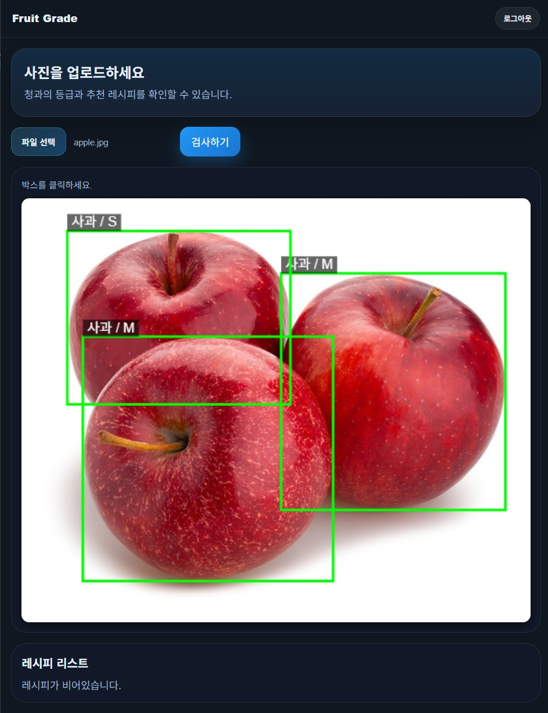
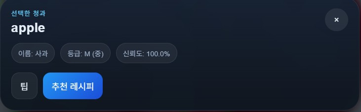
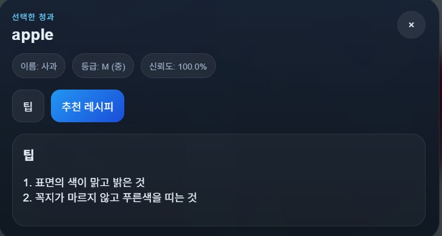
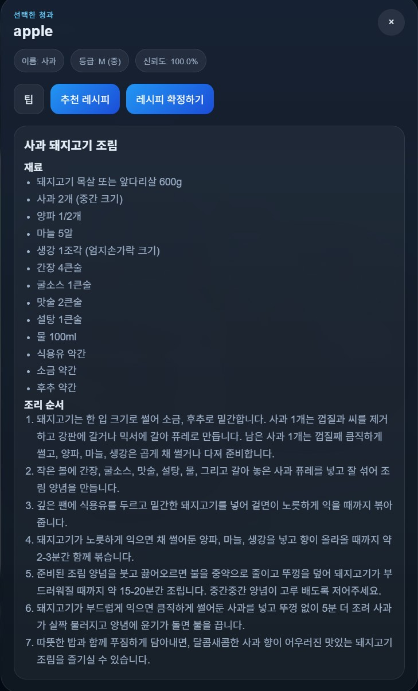
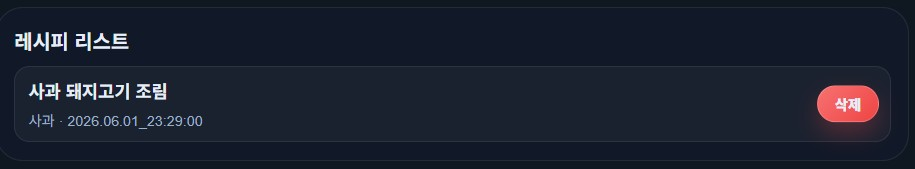
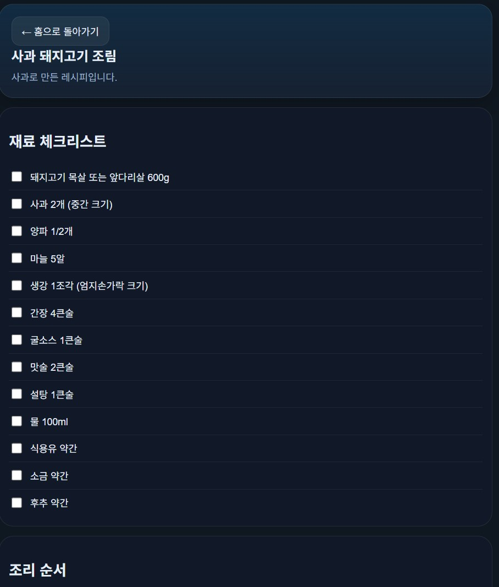

# Fruit Grade

Fruit Grade는 **사진 속 청과**를 **감지**하고, 청과 **종류와 등급을 분류**한 뒤, 선택한 청과에 대한 싱싱한 청과를 고르는 **팁과 추천 레시피**를 보여주는 웹 애플리케이션입니다. 업로드한 이미지 위에 검출 박스를 표시하고, 결과 팝업에서 청과의 정보와 레시피 관련 동작을 이어서 수행할 수 있도록 구성되어 있습니다.

이 프로젝트는 주부에 비해 청과에 대해 잘 모르는 자취생이 마트나 시장에서 청과의 상태를 빠르게 확인하고, 해당 청과에 대한 추천 레시피를 제공하여 해당 장소에서 요리 재료 체크리스트를 통해 추가적인 요리 재료까지 한 번에 얻는 상황을 목표로 합니다. 단순 분류 도구가 아니라, 검사부터 레시피 저장, 상세 확인까지 이어지는 흐름을 하나의 화면 경험으로 묶는 데 초점을 맞췄습니다.

## 주요 기능

- **이미지 업로드** 또는 **카메라 촬영**(모바일 환경)으로 청과 이미지 검사
- **YOLO** 기반 **객체 검출**
- **ResNet** 기반 **청과 분류 및 등급 분류**
- 선택한 청과에 대한 팝업 정보 표시
- 싱싱한 청과 고르는 **팁** 제시
- **LLM** 기반 **추천 레시피** 생성
- 레시피 확정 및 저장
- 저장된 레시피의 요리 재료 체크리스트와 조리 순서 확인
- **로그인/회원가입** 및 사용자별 저장 데이터 관리

## 사용 방법

1. 홈 화면에서 이미지를 업로드합니다. 모바일 환경에서는 카메라 촬영 또한 가능합니다.



2. 서버가 이미지에서 청과 객체를 검출하고, 각 객체에 대한 박스를 화면에 표시합니다.


3. 박스를 클릭하면 해당 청과의 이름과 등급을 보여주는 팝업이 열립니다.


4. 팝업에서 싱싱한 청과를 고르는 팁을 확인하거나, 추천 레시피를 요청할 수 있습니다.



5. 마음에 드는 레시피는 확정해서 저장하고, 홈 화면의 레시피 리스트에서 다시 열어보거나 삭제할 수 있습니다.


6. 저장된 레시피를 클릭하면 재료 체크리스트와 조리 순서를 확인할 수 있습니다.


## API 개요

이 저장소는 FastAPI 기반 백엔드를 사용하며 주요 엔드포인트는 아래와 같습니다.

- `POST /api/detect`: 이미지에서 청과 객체를 검출합니다.
- `POST /api/classify`: 이미지에 있는 작물의 종류와 등급을 분류합니다.
- `POST /api/recipe`: LLM을 사용해 추천 레시피를 생성합니다.
- `GET /api/me/recipes`: 로그인한 사용자의 저장 레시피를 조회합니다.
- `POST /api/me/recipes`: 레시피를 저장합니다.
- `PUT /api/me/recipes/{recipe_id}/checklist`: 체크리스트 상태를 갱신합니다.
- `DELETE /api/me/recipes/{recipe_id}`: 저장된 레시피를 삭제합니다.
- `DELETE /api/me/recipes/{recipe_id}/checklist`: 체크리스트 선택 상태를 초기화합니다.

## 기술 스택

- **Backend**: FastAPI
- **Frontend**: 정적 HTML, CSS, JavaScript
- **Computer Vision**: YOLO, PyTorch, OpenCV
- **LLM**: Gemini 우선 지원

## 모델 및 데이터

- `yolov8n.pt`: 객체 검출 기본 모델
- `crop_classifier_resnet18.pth`: 청과 **종류** 분류 체크포인트 기본값
- `fruit_grade_resnet18.pth`: 청과 **등급** 분류 체크포인트 기본값
- `068.농산물 품질(QC) 이미지/`: 학습 데이터셋 폴더

## 데이터 준비 및 학습 과정

### 1. Roboflow 데이터 준비와 라벨링

한 이미지 안에 여러 개의 청과가 함께 있는 경우를 정확하게 학습시키기 위해 **Roboflow**를 이용해 **인스턴스 분할** 방식으로 라벨링했습니다. 객체가 겹치거나 크기가 서로 다른 경우에도 각 청과의 영역을 세밀하게 구분할 수 있어서, 단순한 박스 라벨보다 더 안정적인 데이터셋을 만들 수 있었습니다.

#### 프로젝트 생성 및 데이터 업로드

- Roboflow에서 새 프로젝트를 만들고, 작업 유형은 인스턴스 분할로 설정했습니다.
- 준비된 이미지 파일을 업로드했습니다.

#### 라벨링 작업

- **스마트 폴리곤** 기능을 사용해 객체를 빠르게 마스킹했습니다.
- Meta의 **SAM2** 모델을 사용한 자동 외곽선 추출 기능으로, 객체를 클릭하면 경계선을 따라 폴리곤이 생성되도록 했습니다.
- 수작업으로 하나씩 외곽선을 그리는 것보다 훨씬 빠르게 라벨링할 수 있었고, 특히 과일이나 채소처럼 형태가 복잡한 객체에 유리했습니다.

#### 검수

- 라벨링이 끝난 뒤에는 각 이미지의 마스크와 클래스가 올바른지 직접 확인했습니다.
- 잘못 표시된 영역이나 누락된 객체는 **승인 또는 반려**로 정리해 품질을 확보했습니다.

#### 전처리 및 데이터 증강

- 학습에 적합한 형태로 이미지를 통일하기 위해 전처리를 적용했습니다.
- **Resize**로 이미지 크기를 맞추고, **Auto-Orient**로 방향을 보정하며, 필요한 경우 흑백 변환 같은 보정도 검토했습니다.
- 데이터가 부족한 클래스에는 증강을 적용했습니다.
- **Flip**과 **Rotate**를 활용해 데이터 다양성을 늘려 모델의 일반화 성능을 높였습니다.

#### 데이터셋 생성 및 내보내기

- 모든 라벨과 설정이 끝나면 데이터셋 버전을 생성했습니다.
- 생성된 데이터셋은 **YOLOv8** 형식으로 내보내 학습 파이프라인에서 바로 사용할 수 있도록 구성했습니다.

#### 정리

- 여러 청과가 한 장면에 함께 등장하는 상황을 고려하면, Roboflow 기반 인스턴스 분할 라벨링이 데이터 품질을 높이는 데 효과적입니다.
- 이 과정을 통해 검출용 데이터셋을 정리한 뒤 `train_yolo.py`와 학습 스크립트에서 사용할 수 있는 형태로 연결했습니다.

### 2. ResNet-101 등급 분류 학습

청과의 **등급 분류**는 **ResNet-101**으로 학습했습니다. 이 모델은 작물의 외형 차이를 바탕으로 등급을 예측하도록 설계했고, 등급 분류 결과는 서비스 화면에서 `L`, `M`, `S` 같은 형태로 사용자에게 보여집니다.

#### 학습 데이터

- 입력 데이터는 `068.농산물 품질(QC) 이미지/` 폴더에 있는 농산물 품질 이미지입니다.
- 학습과 검증은 `01.데이터/1.Training/원천데이터_230921_add`와 `01.데이터/2.Validation/원천데이터_230921_add`를 기준으로 진행했습니다.
- 파일명에 포함된 등급 정보를 읽어서 클래스 라벨로 사용합니다.

#### 학습 방식

- `train.py`는 `torchvision.models.resnet101`의 기본 가중치인 `ResNet101_Weights.DEFAULT`를 사용합니다.
- 마지막 분류층만 데이터셋 클래스 수에 맞게 교체해 청과 등급 분류에 맞도록 미세조정합니다.
- 이미지 전처리는 ResNet-101 기본 transforms를 사용해 입력 크기와 정규화를 맞춥니다.
- 클래스가 너무 불균형하지 않도록 `--max-per-class` 옵션으로 샘플 수를 제한할 수 있습니다.
- 학습이 끝나면 기본 저장 경로는 `fruit_grade_resnet101.pth`이며, 추론 시 이 체크포인트를 사용합니다.

#### 학습 결과의 의미

이 단계의 출력은 이미지 속 청과의 종류가 아니라 품질 등급입니다. 즉, 검출 모델이 "어디에 무엇이 있는지"를 찾는 역할이라면, ResNet-101은 "그 청과가 어느 등급인지"를 판단하는 역할을 맡습니다. 두 모델이 분리되어 있어야 한 이미지 안에 여러 청과가 있는 경우에도 안정적으로 처리할 수 있습니다.

## 실행 방법

### 1. 의존성 설치

```bash
pip install -r requirements.txt
```

### 2. 환경 변수 설정

프로젝트 루트에 `.env` 파일을 만들고 필요 시 아래 값을 설정합니다.

```env
YOLO_MODEL_PATH=yolov8n.pt
CROP_CHECKPOINT=crop_classifier_resnet18.pth
RESNET_CHECKPOINT=fruit_grade_resnet18.pth
LLM_PROVIDER=gemini
LLM_API_KEY=your_api_key
LLM_MODEL=gemini-2.5-flash
LLM_TIMEOUT=10
DEVICE=cpu
```

`LLM_API_KEY`가 없으면 레시피 생성 기능은 동작하지 않을 수 있습니다. API 키를 사용하지 않는 개발 모드에서는 일부 기능이 제한될 수 있습니다.

### 3. 서버 실행

```bash
uvicorn app.main:app --reload
```

브라우저에서 `http://127.0.0.1:8000`을 열면 웹 UI를 확인할 수 있습니다.

## 프로젝트 구조

- `app/`: FastAPI 백엔드
- `static/`: 웹 UI 정적 파일
- `train.py`: 청과 등급 분류 모델 학습
- `train_yolo.py`: 객체 검출 모델 학습
- `train_crop_classifier.py`: 작물 분류 모델 학습

## 개발 참고

- 로그인한 사용자의 레시피와 체크리스트는 파일 기반 저장소에 보존됩니다.
- 모델 경로를 바꿨다면 `.env`와 실제 파일 존재 여부를 함께 확인하는 것이 좋습니다.

## 참고

- 데이터셋 `068.농산물 품질(QC) 이미지`는 이 [링크](https://aihub.or.kr/aihubdata/data/view.do?pageIndex=5&currMenu=115&topMenu=100&srchOptnCnd=OPTNCND001&searchKeyword=&srchDetailCnd=DETAILCND001&srchOrder=ORDER001&srchPagePer=20&srchDataRealmCode=REALM004&aihubDataSe=data&dataSetSn=149)에서 다운받을 수 있습니다.